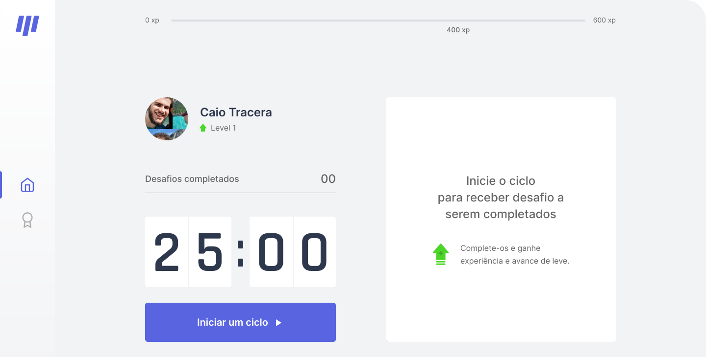

<h1 align="center">
  
</h1>

<h4 align="center">A Next.js Pomodoro Timer app with gamification</h4>

<p align="center">
  

  

  

  <a href="https://www.linkedin.com/in/caiotracera/">
    
  </a>

  <a href="https://github.com/caiotracera/moveit/commits/master">
    
  </a>

  <a href="https://github.com/caiotracera/moveit/issues">
    
  </a>

  
</p>

<blockquote align="center">
“The world needs dreamers and the world needs doers. But above all, the world needs dreamers who do.”
</blockquote>

<p align="center">
  <a href="#rocket-about-the-project">About the project</a>&nbsp;&nbsp;&nbsp;|&nbsp;&nbsp;&nbsp;
  <a href="#man_technologist-technologies">Technologies</a>&nbsp;&nbsp;&nbsp;|&nbsp;&nbsp;&nbsp;
  <a href="#wrench-getting-started">Getting started</a>&nbsp;&nbsp;&nbsp;|&nbsp;&nbsp;&nbsp;
  <a href="#pencil2-todo">Todo</a>&nbsp;&nbsp;&nbsp;|&nbsp;&nbsp;&nbsp;
  <a href="#memo-license">License</a>
</p>

<div align="center">
  
</div>

# :rocket: About the project
<b>Move.it</b> is a pomodoro timer app with gamification made with Next.js for those whom spend a lot of time in computer.

* <b><a href="https://moveit-plum.vercel.app/" target="_blank">Demo</a></b>
* <a href="https://www.figma.com/file/KrsGUQla6fTQuOflaP8gav/Move.it-2.0-Caio-Tracera?node-id=160%3A2761" target="_blank">Layout</a>

# :man_technologist: Technologies

* Next.js
* Styled-components
* Typescript

# :wrench: Getting started

In order to run this project, you must have installed <a href="https://nodejs.org/en/">Node.js</a> and <a href="https://git-scm.com/">Git SCM</a>. If you met all the requirements, follow the instructions:

<b>Clone the project</b>

```shell
$ git clone https://github.com/caiotracera/moveit
$ cd moveit
```

<b>Start the project</b>

```shell
$ npm install # Install all dependencies
$ npm run build # Generate the production build
$ npm run start # Initiate the project at http://localhost:3000/
```

# :pencil2: Todo
- [ ] Make layout responsive
- [ ] Add PWA
- [ ] Make a dark mode
- [ ] Login using Github OAuth
- [ ] Timer under "Encerrar ciclo" button
- [ ] Leaderboard
- [ ] "Falhei" and "Completei" buttons
- [ ] Share in twitter button and image

# :memo: License

Made with :sparkling_heart: by Caio.
<br />
:coffee: Can we have a coffe? <a href="https://www.linkedin.com/in/caiotracera/">Get in touch!</a>
